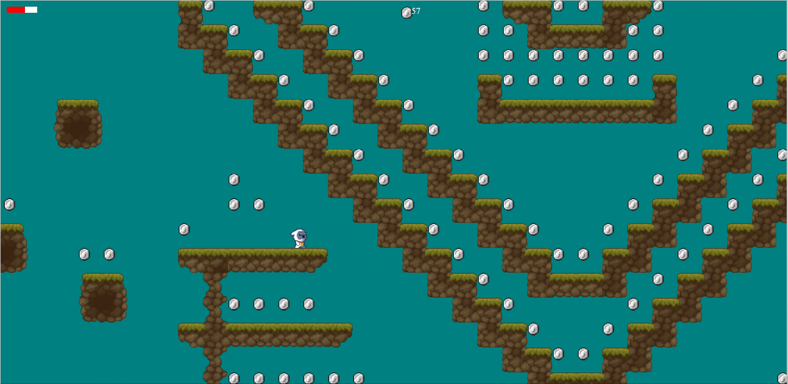

# 2D Platformer Game (TypeScript)
#### Screen Shot:  
#### Video Demo:  [Youtube/PlatformGame](https://youtu.be/pCfwaae1Xkc?si=mqeQbrc7ytJ6rAiP)
#### Try at : [platform-game.onrender](https://platform-game.onrender.com)
#### Description:
This is a 2D platformer game built using TypeScript. The Player can navigate through the different platforms  and collect coins to win the game.

## Technical Details

**Programming Language:** TypeScript

**Rendering Technology:** Canvas

**Key Features:**

* **Platformer Gameplay:** The game features a classic structure where the player navigates platforms, collects items, and avoids getting hurt.
* **Collectibles:** Players need to collect specific items scattered throughout the levels to achieve victory.
* **Physics Engine:** Custom collision detection and physics engine for realistic movement and collisions.
* **Player Movement:** Player can Jump and walk.
* **Level Design:** tile based level design using custom string representation implemented as json in 32*32 chunks.
* **Collision Detection:** Tile based Collision detection.
* **Animation:** Sprite Sheets for the player and other game objects.
* **Sound Effects and Music:** \*\*Yet to implement.

## Code Structure
The project follows a modular structure, separating different functionalities into distinct classes and files.

### Main File (main.ts)

- **Purpose:** Entry point of the game, handles initialization and setup.
- **Responsibilities:**
  - Creates instances of core classes (Player, Camera, EventManager, Level, Controller).
  - Manages the game loop.
  - Handles interactions and overlaps between different game objects.
  - Handles the collision detection.

### Classes

#### Player (player.ts)

- **Purpose:** Represents the player character.
- **Responsibilities:**
  - Manages player movement (walking, jumping, etc.).
  - Handles player animations.
  - records player position.

#### Camera (camera.ts)

- **Purpose:** Controls the game camera.
- **Responsibilities:**
  - Follows the player character.
  - Implements camera scrolling and boundaries.

#### EventManager (eventlistener.ts)

- **Purpose:** Manages game events and triggers actions.
- **Responsibilities:**
  - Listens for events like game states, player input, etc.
  - Executes corresponding actions based on triggered events.

#### Level (level.ts)

- **Purpose:** Handles level loading and management.
- **Responsibilities:**
  - Loads level data (e.g., from a tilemap).
  - Creates and positions game objects based on level data.
  - Manages level transitions.

#### Controller (controller.ts)

- **Purpose:** Handles player input.
- **Responsibilities:**
  - Processes keyboard and touch input events.

## Gameplay Instructions

Use the A,S to move left and right, and W to jump. Collect atleast 100 the coins in each level to progress!

## Limitations
Currently there is only one level in the game.

## Assets

* **Tile set**  [Pixel Art Platformer - Village Props](https://cainos.itch.io/pixel-art-platformer-village-props)
* **Player Sprite** [Tiny-hero-sprites](https://free-game-assets.itch.io/free-tiny-hero-sprites-pixel-art)
* **Coins** [gems-coins-free](https://laredgames.itch.io/gems-coins-free)

**Thank you for making this project possible!**

